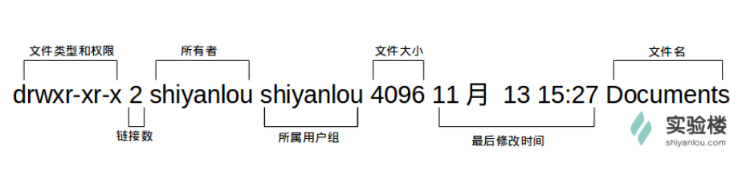
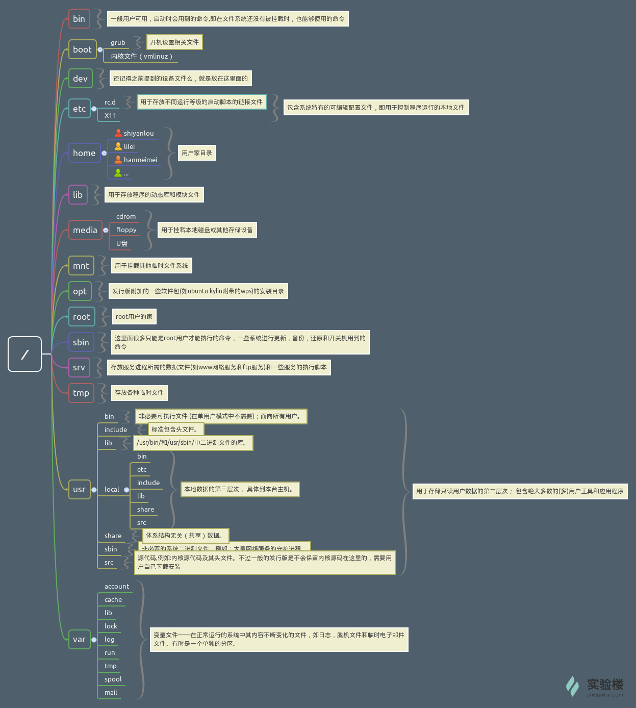
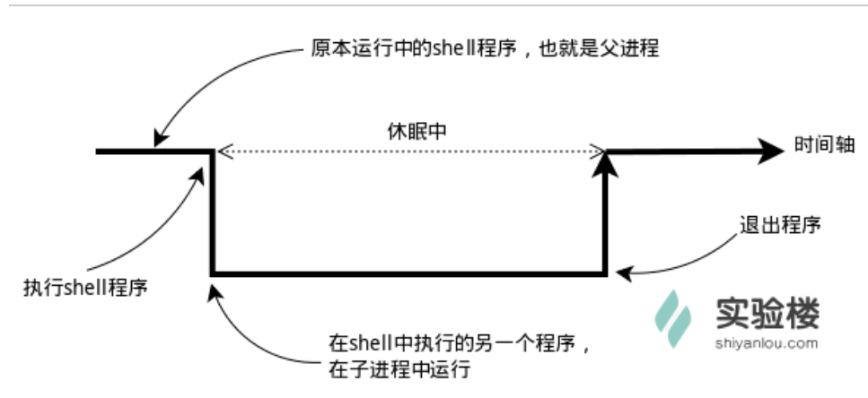
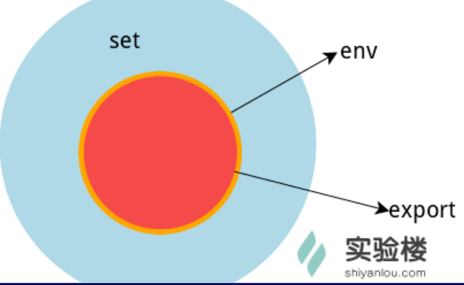

#### 基本概念及操作

* 桌面环境

* linux的哲学：没有结果就是最好的结果

* 常用快捷键
  * tab：补全命令
  * ctrl+c:强行终止当前程序
  * ctrl + d:键盘输入结束或推出终端
  * ctrl + s:暂停当前程序，按下任意键恢复
  * ctrl + z:将当前程序放到后台运行，fg恢复到前台
  * ctrl + a:将光标移至输入行头，home
  * ctrl + e:将光标移至输入行尾，end
  * ctrl + k:删除光标所在位置到行末
  * alt + backspace:向前输出一个单词
  * shift + pgup:
  * shift + pgdn:

* 通配符的使用：
  * *：0个或多个
  * ?: 任意一个
  * [list]:list中的任意一个
  * [!list]:list中意外的任意一个
  * [c1-c2]: 之中的任意一个
  * {string1, string2, ...}: 其中的一个字符串
  * {c1..c2}: 匹配中的全部字符

* 创建多个文件：touch love_{1..10}_linux.txt

* 获取帮助：man <command>, 命令的--help参数, 

* 出入图形字符命令：banner, printerbanner

#### 用户及文件权限管理

* 用户
  * 查看用户： who am i,  who mom likes, whoami, 
  * who的常用参数：-a, -d, -m, -q, -u, -r
  * su <usr>: 切换用户，需要输入目标用户的密码
  * sudo <cmd>: 可以以特权级别运行command
  * su - <usr>: 也是切换用户，同时环境变量也会跟着变
* 用户组：
  * groups命令查看用户组：groups shiyanlou
  * 查看/ect/group文件
  * 将其他用户加入sudo用户组： sudo usermod -G sudo lilei
  * 删除用户：sudo deluser lilei --remove-home
* 文件权限：
  * 查看文件权限：ls -l
  
  
  * 一个目录要同时具备都权限和执行权限才可以打开并查看内部文件，而一个目录要有写权限才允许在其中创建其它文件
* 变更文件所有者：
  * sudo chown <usr> <filename>
* 修过文件权限：
  * 通过数字修改：chmod 700 <filename>
  * 通过加减赋值操作：chmod go+rw <filename>
* 更多：
  * adduser与useradd的区别：后者很多还需要自己去设置，而前者会提示全部设置完毕
* 作业：
  * 添加新用户loutest： sudo adduser loutest
  * sudo创建文件/opt/forloutest: sudo touch /opt/forluotest
  * 文件设置为loutest可以读写: sudo chmod 666 /opt/forloutest, sudo chmod ugo+rw /opt/forloutest

#### Linux目录结构及文件基本操作

* Linux目录结构
  * FHS标准：定义了两层规范
    * 第一层：/下面的各个目录应该要放什么文件数据，如/etc放设置文件，/bin与/sbin放可执行文件
    * 第二层：/usr及/var这两个目录的子目录。如/var/log放置系统登陆文件，/usr/share防止共享数据
     
    * 命令行查看： tree /
    
* 目录路径：
  * .当前目录， ..上一级目录， ~home目录
  * pwd获取当前路径
  * cd ../..的使用
* Linux文件的基本操作：
  * 新建：
    * touch: 创建空白文件，更改已有文件的时间戳
    * 新建目录：mkdir, mkdir -p father/son/grandson
* 复制：
  * 复制文件：cp <filename> <directorname>
  * 复制目录：cp <dirname> [-r] <dirname>
  * 删除文件/目录：rm [-r] <filename/dirname>
  * 移动文件/重命名：mv 原目录文件（旧的文件名） 目的目录（新的文件名）
  * 批量重命名： rename 
* 查看文件：
  * cat：正序 cat -n <filename>
  * tac: 倒序
  * nl: 添加行号并打印
  * more：
  * less：
  * head：
  * tail：
* 查看文件类型：
  * file <filename>
* 编辑文件：
  * vim， emacs， nano

* 更多：
  * 召唤出一双眼睛：xeyes, 后台运行：nohup xeyes &
* 作业：
  * 创建一个homework目录 mkdir homework
  * 建立名为1.txt~10.txt文件 touch {1..10}.txt
  * 删除1.txt~5.txt rm -f {1..5}.txt
  * Linux的日志文件在哪个目录？ var/log

#### 环境变量与文件查找

* 变量：
  * 用declare声明或即用即创建： declare tmp / tmp=shiyanlou(等号两边无空格)
* 环境变量：
  * Shell的环境变量作用于自身和它的子进程。每个进程都有其各自的环境变量的设置
  
* 涉及的三种变量类型：
  * 当前shell进程私有用户自定义变量，只在当前shell中有效
  * shell本身内建的变量
  * 从自定义变量导出的环境变量
  * set：显示当前shell所有变量，包含以上三种
  * env：显示当前于用户相关的环境变量，还可以让命令在制定环境中运行
  * export 显示从shell中导出称环境变量的变量，也能通过它将自定义变量导出为环境变量
  
* 变量的生命周期：
  * 永久的：需要修改配置文件，变量永久生效
  * 临时的：使用export命令声明即可，变量在关闭shell时失效
  * /etc/bashrc：shell变量  /etc/profile：环境变量
  * 每个用户目录下隐藏的.profile，只对当前环境生效
* 命令的查找路径与顺序：
  * 查看：echo $PATH
  * 添加自定义路径：PATH=$PATH:<dirname>
  * 在每个用户的home目录中有一个shell每次启动时会默认执行一个配置脚本，以初始化环境，包括添加一些用户自定义环境变量等等。zsh的配置文件时.zshrc, bash的为.bashrc。它们在etc下还都有一个或多个全局的配置文件，一般只修改用户目录下的。
  * 例如：echo "PATH=$PATH:/home/shiyanlou/mybin">> .zshrc(注意重定向符，两个表示的是追加不是覆盖)
* 修改和删除已有变量
  * 变量修改的几种方式：
    * ${变量名#匹配字符串}：从头向后开始匹配，删除符合匹配字符串的最短数据
    * ${变量名##匹配字符串}：从头向后开始匹配，删除符合匹配的最长数据
    * ${变量名%匹配字符串}：从尾开始匹配，删除符合匹配最短数据
    * ${变量名%匹配字符串}：从尾开始匹配，删除符合匹配最长山上
  * 变量删除：unset <variable name>
* 如何让环境变量立即生效：
  * source .zshrc

* 搜索文件：
  * whereis: whereis who
    * 不从硬盘中查找，直接从数据库查找
  * which
    * 小而精，shell内建的一个命令，我们通常使用which查看是否安装了某个软件，只从PATH环境变量指定的路径中查找
  * find
    * 精而细，功能强，如：sudo find /etc/ -name interfaces   find [path] [option] [action]
  * locate
    * 通过/var/lib/mlocate/mlocate.db数据库查找，非实时，系统定时通过updatedb更新，如：locate /usr/share/\*.jpg

* 更多
  * 黑客帝国满屏“数字与”实现：cmatrix + 修改终端主题为黑底绿字

* 作业
  * 寻找/etc/目录下的所有以.list结尾的文件, locate /etc/\*.list  sudo /etc/ -name \*.list

#### 挑战：寻找文件

* 找到sources.list文件 sudo find /etc/ -name sources.list
* 把文件所有者改为自己 sudo chown shiyanlou sources.list
* 把权限修改为仅仅自己可读可写 chmod 600 sources.list

#### 文件打包与压缩

* 概念：
  * 常见的后缀名：gz, xz, bz2, tar, tar,gz, tar,xz, tar.bz2
* zip压缩打包程序
  * 使用zip打包文件夹： zip -r -q -o shiyanlou /home/shiyanlou   du -h shiyanlou.zip   file shiyanlou.zip
  * 设置压缩级别：zip -r -9 -q -o shiyanlou_9.zip -x ~/*.zip
  * 创建加密：zip -r -e -q -o shiyanlou_encryption.zip /home/shiyanlou
  * 如果想要使得压缩文件在windows下打开正常换行，使用 -l 将lf转换为cr + lf
  * 使用unzip解压：unzip shiyanlou.zip -d ziptest
  * 查看不解压：unzip -l shiyanlou.zip
  * 解压时注意编码问题，可制定编码：unzip -O GBK 中文压缩文件.zip
* rar打包压缩命令：
  * rar a shiyanlou.rar .
  * 从指定压缩包文件中删除某个文件： rar d shiyanlou.rar .zshrc
  * 查看不解压文件：rar l shiyanlou.rar
  * 全路径解压：unrar x shiyanlou
  * 去掉路径解压： unrar e shiyanlou.rar tmp/
* tar打包工具
  * 创建tar包： tar -cf shiyanlou.tar ~
  * 解包一个文件：tar -xf shiyanlou.tar -C tardir(已存在)
  * 只查看不解包：tar -tf shiyanlou.tar
  * 保留文件属性和跟随链接：tar -cphf etc.tar /etc
  * 添加参数-z使用gzip压缩文件：tar -czf shiyanlou.tar.gz ~
  * 压缩格式及对应参数：
    * *.tar.gz  -z
    * *.tar.xz  -J
    * *.tar.bz2 -j
* 总结：
  * zip常用命令总结：
    * 打包： zip something.zip something (目录加-r参数)
    * 解包： unzip something
    * 制定路径：-d 参数
  * tar常用命令总结：
    * 打包：tar -zcvf something.tar something
    * 解包：tar -zxvf something.tar
    * 制定路径：-C 参数
* 作业：
  * touch test
  * zip test.zip test
  * tar -cf test.tar test
  * unzip test.zip -d /home/shiyanlou
  * tar -xf test.tar -C /home/shiyanlou

#### 文件系统操作与磁盘管理

* 查看磁盘和目录容量
  * df命令：-h
  * du命令：-h  du -h -d 0 ~
* 简单磁盘管理：
  * dd命令：暂略
  * mount命令挂载磁盘到目录树： mount [options] [source] [directory]

#### Linux下的帮助命令

* 内建命令与外部命令
  * 内建命令：实际上时shell程序的一部分，写在bash源码的builtins里面的，由shell识别并在shell程序内部完成运行，不需要创建子进程，快，如：history, cd, exit
  * 外部命令：实用，比较大，不会随系统加载到内存中，调用时加载。通常在/bin, /usr/bin, /sbin, /usr/sbin，如：ls， vi
  * type可以区分：type ls
* 帮助命令的使用：
  * help：bash中有的，内建命令的简要帮助
  * 对于外部命令一般都有--help参数，如：--help
  * man命令：无内件与外部之分
  * info：

#### Linux任务计划crontab

* crontab简介：
* crontab使用：
  * 添加：crontab -e
  * 查看：crontab -l
  * 检查： ps aux | grep cron  或 pgrep cron
  * 删除任务：crontab -r
* crontab的深入：
  * 使用crontab -e添加计划任务后，都会在/var/spool/cron/crontabs中添加一个该用户自己的任务文档，目的是为了隔离
  * 系统级别的任务需要以sudo权限编辑/etc/crontab文件

#### 挑战：备份日志

#### 命令执行顺序控制与管道

* 顺序执行多条命令：用分号隔开，如：sudo apt-get update; sudo apt-get install some-tool; some-tool
* 有选择的执行命令：which cowsay>/dev/null &&(或||意义不同) cowsay -f head-in ohcw~
* 管道：
  * 一种通信机制，常用于进程间的通信，表现出来就是将前面一个进程的输出（stdout）直接作为下一个进程的输入（stdin）
  * 试用：ls -al /etc | less
  * cut命令：cut /etc/passwd -d ':' -f 1,6
  * grep命令：在文本中或stdin中查找匹配字符串： grep [命令选项] ...用于匹配的表达式 [文件], 如：grep -rnI "shiyanlou" ~
  * wc：简单小巧的计数工具，如：wc /etc/passwd  ls -dl /etc/*/ | wc -l
* sort排序命令：
  * cat /etc/passwd | sort
  * cat /etc/passwd | sort -r 
  * cat /etc/passwd | sort -t ':' -k 3
* uniq去重命令：

#### 简单的文本处理

* 文本处理命令：
  * tr命令：tr [options]...SET1 [SET2]
    * -d: 删除和set1匹配的字符，不是全词匹配也不是按字符顺序匹配
    * -s: 去除set1指定的在输入文本中连续并重复的字符
  * col命令：可以将tab换成对等数量的空格键，或反转, col [option]
    * -x 将tab转换为空格
    * -h 将空格转换为tab
  * join命令：[option]... file1 file2
    * -t: 指定分隔符，默认为空格
    * -i: 忽略大小写差异
    * -1：指明第一个字段要用那个字段来对比
    * -2：
  * pasta命令：将多个文件合并一起， paste [option] file...
    * -d: 指定合并的分割符  
    * -s: 不合并到一行，每个文件为一行

#### 数据流重定向

* 简单的重定向：
  * 0  /dev/stdin  标准输入
  * 1  /dev/stdout 标准输出
  * 2  /dev/stderr 标准错误
* 标准错误重定向：
  * 2>&1

* 使用tee命令同时重定向到多个文件， echo 'hello shiyanlou' | tee hello
* 用久重定向：zsh,  exec 1>somefile,    ls,   exit,   cat somefile

* 创建输出文件描述符
  * shell中有9个文件描述符，默认提供了0， 1， 2，还有3-8可用
  * 查看当前shell进程中打开的文件描述符：cd /dev/fd/; ls -Al
  * zsh,  exec 3>somefile,  cd /dev/fd/; ls -Al; cd -,  echo "this is test" >&3,  cat somefile, exit
* 关闭文件描述符： exec 3>&-
* 完全屏蔽命令的输出：cat Docuemnts/test.c nefile 1>/dev/null 2>&1
* 使用xargs分割参数列表：cut -d: -f1 < /etc/passwd | sort | xargs echo

#### 挑战：历史命令

#### 正则表达式

* 选择
  * `|`表示选择：如`boy|girl`表示`boy`和`girl`
* 数量
   * `+`表示前面的字符出现一次或多次
   * `?`表示前面的字符出现零次或一次
   * `*`表示前面的字符出现0次，一次或多次
* 优先级：`()`括号可以用来改变优先级
* 语法：

字符|描述
-|-
`\`|将下一个字符描述为特殊字符
`^`|匹配字符串的开始位置
`$`|匹配字符串的结束位置
`{n}`|匹配确定的n次
`{n,}`|匹配至少n次
`{n,m}`|最少匹配n次，最多匹配m次
`*`|匹配前面的子表达式0次或多次
`+`|匹配前面的子表达式一次或多次
`?`|匹配前面的子表达式0次或一次
`?`|当该字符紧跟在任何一个其他限制符（*,+,?，{n}，{n,}，{n,m}）后面时，匹配模式是非贪婪的。非贪婪模式尽可能少的匹配所搜索的字符串，而默认的贪婪模式则尽可能多的匹配所搜索的字符串。例如，对于字符串“oooo”，“o+?”将匹配单个“o”，而“o+”将匹配所有“o”。
`.`|匹配除"\n"外的任何单字符
`(pattern)`|**匹配pattern并获取这一匹配的子字符串**。该子字符串用于向后引用。要匹配圆括号字符，请使用“\(”或“\)”。
`x | y`|**匹配x或y**。例如，“z｜food”能匹配“z”或“food”。“(z｜f)ood”则匹配“zood”或“food”。
`[xyz]`|字符集合（character class）。**匹配所包含的任意一个字符**。例如，“[abc]”可以匹配“plain”中的“a”。其中特殊字符仅有反斜线\保持特殊含义，用于转义字符。其它特殊字符如星号、加号、各种括号等均作为普通字符。脱字符^如果出现在首位则表示负值字符集合；如果出现在字符串中间就仅作为普通字符。连字符 - 如果出现在字符串中间表示字符范围描述；如果出现在首位则仅作为普通字符。
`[^xyz]`|排除型（negate）字符集合。**匹配未列出的任意字符**。例如，“[^abc]”可以匹配“plain”中的“plin”。
`[a-z]`|字符范围。**匹配指定范围内的任意字符**。例如，“[a-z]”可以匹配“a”到“z”范围内的任意小写字母字符。
`[^a-z]`|排除型的字符范围。**匹配任何不在指定范围内的任意字符**。例如，“[^a-z]”可以匹配任何不在“a”到“z”范围内的任意字符。

* 优先级：从上到下，从左至右依次降低

运算符|说明
--|--
`\`|转义符
`(),(?:),(?=),[]`|括号和中括号
`*,+,?,{n},{n,},{n,m}`|限定符
`^,$,\任何元字符`|定位点和序列
`|`|选择

* grep: 命令用于打印输出文本中匹配的模式串，它使用正则表达式作为模式匹配的条件.grep支持三种正则表达式引擎，分别用三个参数指定：

参数|说明
--|--
`-E`|POSIX扩展正则表达式，ERE
`-G`|POSIX基本正则表达式，BRE
`-P`|Perl正则表达式，PCRE

常用参数：

参数|说明
--|--
`-b`|将二进制文件作为文本来进行匹配
`-c`|统计以模式匹配的数目
`-i`|忽略大小写
`-n`|显示匹配文本所在行的行号
`-v`|反选，输出不匹配行的内容
`-r`|递归匹配查找
`-A n`|n为正整数，表示after的意思，除了列出匹配行之外，还列出后面的n行
`-B n`|n为正整数，表示before的意思，除了列出匹配行之外，还列出前面的n行
`--color=auto`|将输出中的匹配项设置为自动颜色显示

特殊符号及说明：

特殊符号|说明
--|--
`[:alnum:]`|代表英文大小写字母及数字，亦即 0-9, A-Z, a-z
`[:alpha:]`|代表任何英文大小写字母，亦即 A-Z, a-z
`[:blank:]`|代表空白键与 [Tab] 按键两者
`[:cntrl:]`|代表键盘上面的控制按键，亦即包括 CR, LF, Tab, Del.. 等等
`[:digit:]`|代表数字而已，亦即 0-9
`[:graph:]`|除了空白字节 (空白键与 [Tab] 按键) 外的其他所有按键
`[:lower:]`|代表小写字母，亦即 a-z
`[:punct:]`|代表标点符号 (punctuation symbol)，亦即：" ' ? ! ; : # $...
`[:print:]`|代表任何可以被列印出来的字符
`[:upper:]`|代表大写字母，亦即 A-Z
`[:space:]`|任何会产生空白的字符，包括空白键, [Tab], CR 等等
`[:xdigit:]`|代表 16 进位的数字类型，因此包括： 0-9, A-F, a-f 的数字与字节

* sed: `sed`工具在 `man` 手册里面的全名为"sed - stream editor for filtering and transforming text"，意即，用于过滤和转换文本的流编辑器。(暂略)

* awk：(暂略)

  